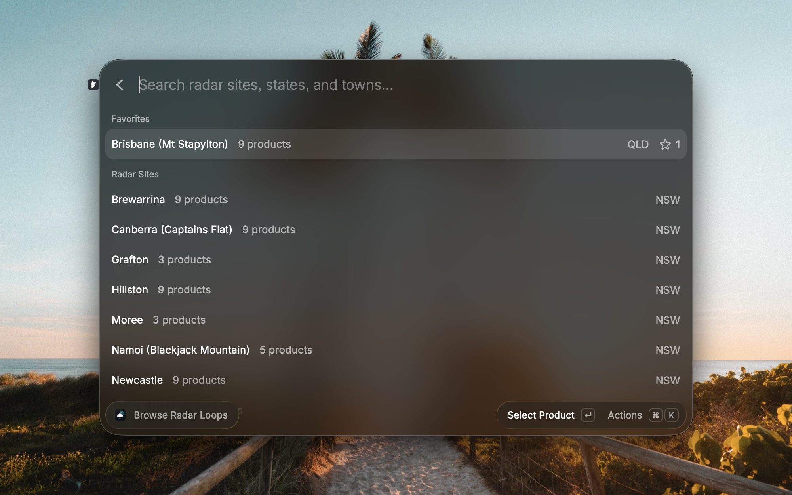
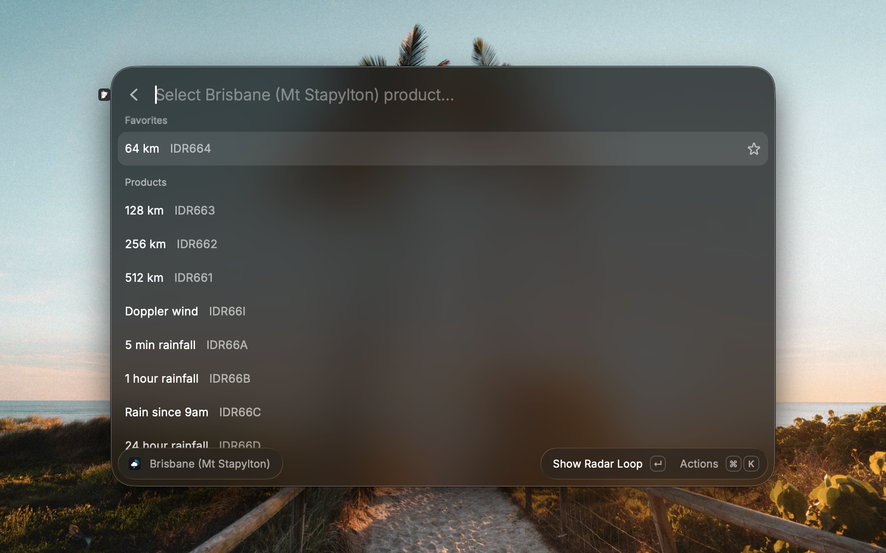
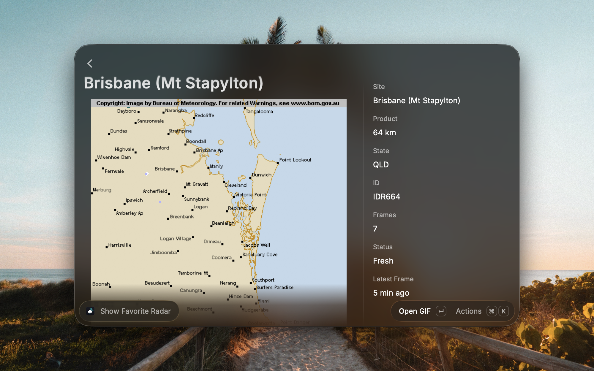
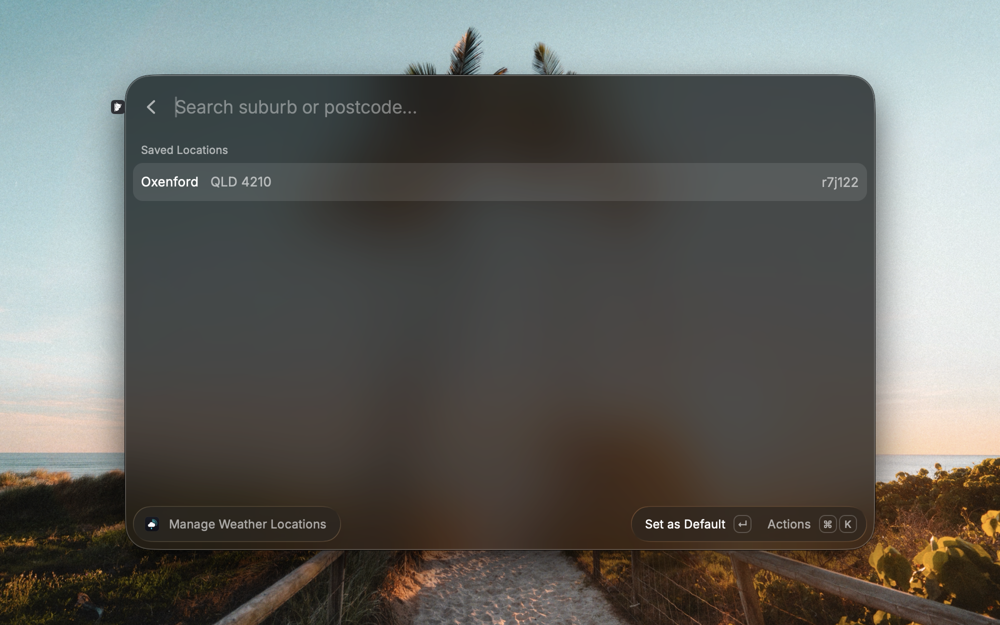
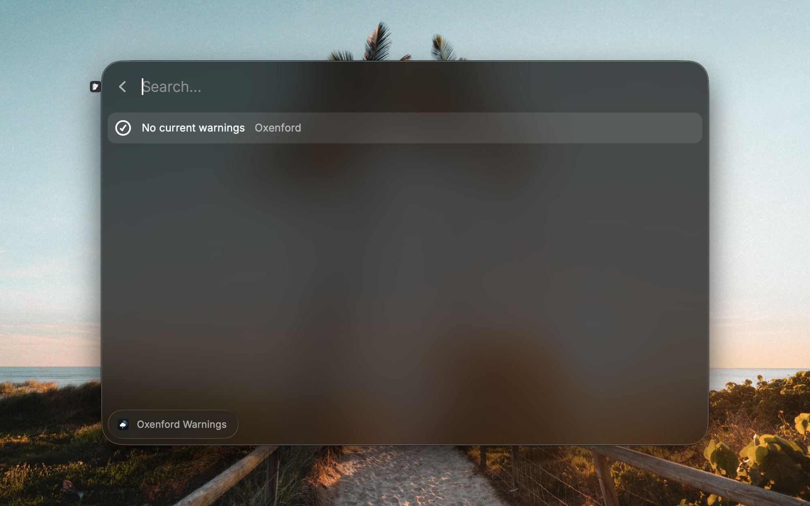

# Australian BOM Weather for Raycast

Fast access to Australian Bureau of Meteorology weather from Raycast: radar loops, forecasts, warnings, current conditions, and a menu bar temperature glance without opening the BoM website.

This is an unofficial, personal-use Raycast extension for Australian weather data. It is not affiliated with, endorsed by, or supported by the Bureau of Meteorology, and it is not distributed through the Raycast Store.

## Features

- Browse BoM radar sites across Australia and render animated radar loops directly in Raycast.
- Save radar sites and set a quick favorite for the radar you check most often.
- Search and save BoM forecast locations by suburb or postcode.
- View current conditions, daily forecasts, hourly forecasts, rain chance, wind, humidity, and warnings for your saved location.
- Keep the current temperature in the menu bar.
- Show a quick weather summary in Raycast root search, then jump straight into the forecast.
- Cache data conservatively so normal use is quick and avoids repeatedly hitting BoM pages.

This extension is for Australian weather data only. It does not provide NOAA/NWS, Met Office, Environment Canada, or other international weather radar.

## Screenshots

### Browse Radar Sites



### Choose Radar Products



### Render Radar Loops



### View Forecasts


### Manage Locations



### Check Warnings



## Requirements

- macOS
- Raycast or Raycast Beta
- Node.js and npm

## Installation

For normal use, you do not need to keep a development server running. Build the extension, then import the local extension directory into Raycast.

```bash
git clone https://github.com/itstongy/australian-bom-weather.git
cd australian-bom-weather
npm install
npm run build
```

Then open Raycast and run **Import Extension**. Select this repository folder. The commands should appear in Raycast root search.

If Raycast does not show **Import Extension**, use Raycast's development import once:

```bash
npm run dev
```

After the extension appears in Raycast, stop the terminal process with `Ctrl+C`. Raycast's extension docs say the extension stays installed after `npm run dev` stops; you only need to run it again when changing or rebuilding the extension during development.

To update later:

```bash
git pull
npm install
npm run build
```

Local extensions are managed by you, not automatically updated from the Raycast Store. If Raycast does not pick up the rebuilt extension, run **Import Extension** again or run `npm run dev` once and stop it after the extension refreshes.

## First Run

1. Open **Manage Weather Locations** and save a suburb or postcode.
2. Set your usual location as the default.
3. Open **View Forecast** to check current, daily, and hourly conditions.
4. Open **Browse Radar Loops**, choose a radar site, and optionally set a quick favorite.
5. Enable **Current Weather** if you want the temperature in the menu bar.

## Commands

- **Browse Radar Loops** - Search BoM radar sites, choose radar products, render loops, and save favorites.
- **Show Favorite Radar** - Open your quick favorite radar loop immediately.
- **Manage Weather Locations** - Search and save forecast locations by suburb or postcode.
- **View Forecast** - See current, daily, and hourly forecasts for a saved location.
- **Weather Warnings** - View current BoM warnings for your selected location.
- **Weather Summary** - Update Raycast root-search metadata with current weather.
- **Current Weather** - Show current BoM weather in the menu bar.

## Why It Is Not in the Raycast Store

This extension is intentionally not submitted to the Raycast Store. It is an unofficial personal tool that reads Bureau of Meteorology website resources and radar imagery for convenience inside Raycast. It is not built on a Bureau Registered User service, paid FTP subscription, GIS2Web service, or separate data licence agreement.

The Bureau's published terms do not fit neatly with broad redistribution of this kind of extension:

- The Bureau's default copyright terms allow downloading, copying, and using content for personal use or within an organisation, but not supplying it to other people or using it commercially unless permission is granted.
- The Bureau says automated or manual techniques to hack, scrape, or otherwise extract material from its site are not authorised.
- Radar images, high-resolution maps, and other specialised data may require a data licence agreement to access, reproduce, or publish.
- The Bureau's anonymous FTP catalogue says public FTP products are subject to the default copyright notice, and users intending to publish Bureau data should do so as registered users.
- The Registered User Services catalogue lists subscription products for forecasts, observations, radar images, Rainfields radar data, and related products, with registration and annual fees.

Treat this as a personal-use tool. Install it manually, use it respectfully, and do not redistribute BoM data, radar imagery, or generated assets in a way that conflicts with Bureau terms.

## Attribution and Use

Weather data is sourced from the Bureau of Meteorology. Copyright remains with the Bureau of Meteorology.

This extension is intended for personal, non-commercial use. Bureau information is subject to the Bureau's copyright notice, disclaimer, and data service terms. Some Bureau products, including radar images and specialised data, may require a data licence agreement for reproduction, publication, redistribution, or commercial use.

Relevant Bureau pages:

- Copyright: https://www.bom.gov.au/copyright
- FTP public products: https://www.bom.gov.au/catalogue/anon-ftp.shtml
- Registered User Services catalogue: https://www.bom.gov.au/other/charges.shtml
- Disclaimer: https://www.bom.gov.au/disclaimer
- Data services: https://www.bom.gov.au/resources/data-services
- Brand and attribution policy: https://www.bom.gov.au/data-access/brand-trademark-display-policy.shtml

Relevant Raycast pages:

- Extensions manual: https://manual.raycast.com/extensions
- Create your first extension: https://developers.raycast.com/basics/create-your-first-extension

## Cache Policy

The extension caches data to avoid repeated requests and to stay aligned with normal Bureau update frequencies:

- Radar site/product catalogue: 7 days
- Radar frame index: 3 minutes
- Rendered radar GIFs: 3 minutes
- Observations: 10 minutes
- Hourly forecast: 30 minutes
- Daily forecast: 1 hour
- Warnings: 30 minutes

These cache windows are intentionally conservative for an interactive personal-use extension. They should be revisited before any public or commercial distribution.

## Troubleshooting

- **Commands do not appear in Raycast:** run **Import Extension** again, or run `npm run dev` once to refresh Raycast's local copy.
- **Forecast or warnings are empty:** open **Manage Weather Locations** and make sure a default location is saved.
- **Radar loop fails to render:** the BoM radar product may be offline, stale, or temporarily unavailable. Try refreshing or selecting another product for the same site.

## Development

```bash
npm install
npm run dev
```

Useful checks before committing:

```bash
npm run build
npm test
```

## License

The extension code is [MIT licensed](LICENSE). Bureau of Meteorology content, data, radar imagery, names, and marks remain subject to Bureau terms.
